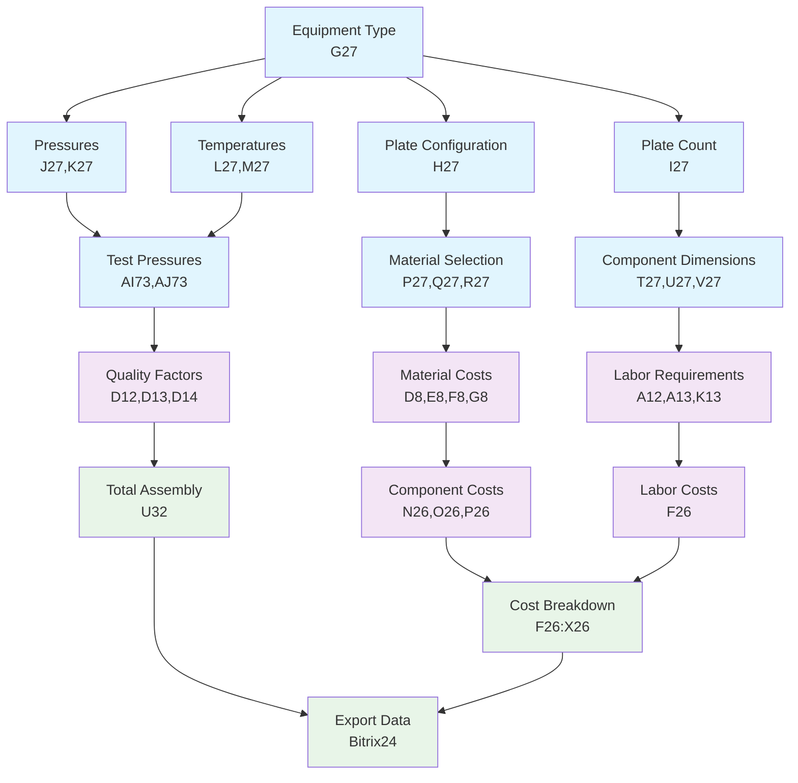

# Field Implementation Roadmap

## Heat Exchanger Cost Calculator

---

## Executive Summary

**Project Status:** 85/1795 fields implemented (4.7% complete)

**Critical Path to MVP:** Focus on 200 core fields across 4 phases  
**Timeline:** 8-12 weeks for MVP with full dependency resolution

### Current Implementation Analysis

```
IMPLEMENTED (85 fields):
├── technical_parameters: 45 fields (technologist role)
├── cost_calculations: 15 fields (mixed roles)
├── supply_parameters: 20 fields (supply role)
└── material_specifications: 5 fields (technologist role)

REMAINING (1710 fields):
├── supply_parameters: 1559 fields (92% of total)
├── technical_parameters: 58 fields
├── uncategorized: 62 fields
├── cost_calculations: 21 fields
└── others: 10 fields
```

---

## Formula Dependency Architecture

### Core Dependency Chain (Critical Path)

```
Phase 1: Input Collection (15 fields)
    ↓
Phase 2: Technical Calculations (25 fields)
    ↓
Phase 3: Material Requirements (35 fields)
    ↓
Phase 4: Cost Aggregation (125 fields)
    ↓
RESULT: Complete Cost Breakdown
```

### Visual Dependency Graph



---

## Phase-Based Implementation Roadmap

### Phase 1: Core MVP Foundation (4-6 weeks)

**Priority: CRITICAL | Fields: 75 | Effort: High**

#### 1.1 Essential Input Collection (15 fields)

- **technologist role (10 fields)**
  - Equipment specifications: G27, H27, I27
  - Operating parameters: J27, K27, L27, M27
  - Material selection: P27, Q27, R27
- **supply role (5 fields)**
  - Base pricing: D8, E8, F8, G8
  - Labor rate: A12

#### 1.2 Core Technical Calculations (25 fields)

- **Pressure calculations**
  - Test pressure formulas: AI73, AJ73
  - Safety margin calculations: N27, O27
- **Material requirement formulas**
  - Plate mass calculations: 8 fields
  - Component mass calculations: 12 fields
  - Waste factor applications: 5 fields

#### 1.3 Basic Cost Engine (35 fields)

- **Primary cost components**
  - Material costs: F26, G26, H26, I26, J26
  - Labor costs: Basic formula implementation
  - Component totals: N26, O26, P26
- **Essential aggregations**
  - Category totals: J30-J36 (7 fields)
  - Grand total: U32
  - Export preparation: 18 fields

**Phase 1 Deliverable:** Working calculator with 75 core fields producing accurate cost estimates

---

### Phase 2: Extended Calculations (6-8 weeks)

**Priority: HIGH | Fields: 125 | Effort: Medium**

#### 2.1 Advanced Material Calculations (45 fields)

- **Enhanced material processing**
  - Cladding calculations: Complex formulas
  - Cutting optimization: A14-A17 corrections
  - Waste minimization: Advanced algorithms
- **Component specifications**
  - Fastener calculations: 15 fields
  - Gasket requirements: 10 fields
  - Auxiliary components: 20 fields

#### 2.2 Supply Chain Integration (50 fields)

- **Vendor management**
  - Material sourcing options: 20 fields
  - Price variation handling: 15 fields
  - Lead time calculations: 15 fields
- **Logistics calculations**
  - Internal logistics: P13, P19
  - Distribution costs: Calculated fields
  - Packaging requirements: Calculated fields

#### 2.3 Quality & Compliance (30 fields)

- **Testing requirements**
  - Pressure test specifications
  - Quality control parameters
  - Certification tracking
- **Regulatory compliance**
  - Material certificates
  - Process documentation
  - Audit trail fields

**Phase 2 Deliverable:** Production-ready system with comprehensive cost modeling

---

### Phase 3: Supply Chain Features (8-10 weeks)

**Priority: MEDIUM | Fields: 200+ | Effort: Medium**

#### 3.1 Advanced Supply Parameters (150 fields)

- **Detailed material specifications**
  - Alternative materials matrix
  - Quality grade variations
  - Vendor-specific pricing
- **Complex logistics**
  - Multi-stage delivery
  - Inventory optimization
  - Just-in-time calculations

#### 3.2 Project Management Integration (50 fields)

- **Project tracking**
  - Order management: A3-A8 fields
  - Timeline integration
  - Resource allocation
- **Client relationship management**
  - Customer-specific requirements
  - Contract terms integration
  - Delivery coordination

**Phase 3 Deliverable:** Enterprise-grade supply chain management

---

### Phase 4: Analytics & Optimization (10-12 weeks)

**Priority: LOW | Fields: 300+ | Effort: Low**

#### 4.1 Advanced Analytics (200 fields)

- **Performance metrics**
  - Cost trend analysis
  - Profitability optimization
  - Efficiency indicators
- **Predictive modeling**
  - Demand forecasting
  - Price fluctuation analysis
  - Risk assessment

#### 4.2 Reporting & Export (100+ fields)

- **Enhanced reporting**
  - Detailed cost breakdowns
  - Comparative analysis
  - Profitability reports
- **Integration expansion**
  - ERP system connections
  - Business intelligence tools
  - Custom export formats

**Phase 4 Deliverable:** Comprehensive business intelligence platform

---

## Critical Dependencies & Blockers

### High-Priority Dependencies

1. **Material Property Database** (affects 400+ fields)
   - Density tables for all materials
   - Price matrices with vendor data
   - Quality specifications

2. **VLOOKUP Table Implementation** (affects 300+ fields)
   - Equipment specification tables
   - Material property lookups
   - Cost calculation matrices

3. **Formula Engine Architecture** (affects 200+ fields)
   - Excel formula translation
   - Dependency resolution
   - Circular reference handling

### Technical Blockers

- **Complex Excel Formulas:** 45 fields require advanced formula parsing
- **Named Range Dependencies:** 85 fields depend on dynamic ranges
- **Interpolation Logic:** 25 fields need custom interpolation algorithms

---

## Role-Based Implementation Priorities

### Technologist Role (139 fields total, 45 implemented)

**Remaining: 94 fields**

- **Phase 1:** 25 fields (core technical parameters)
- **Phase 2:** 35 fields (advanced calculations)
- **Phase 3:** 25 fields (quality specifications)
- **Phase 4:** 9 fields (analytics)

### Supply Role (1622 fields total, 20 implemented)

**Remaining: 1602 fields**

- **Phase 1:** 50 fields (essential supply parameters)
- **Phase 2:** 90 fields (material management)
- **Phase 3:** 150 fields (supply chain optimization)
- **Phase 4:** 1312 fields (advanced analytics & reporting)

---

## Success Metrics & Milestones

### Phase 1 Success Criteria

- [ ] 75 core fields implemented (90% increase)
- [ ] Basic cost calculation accuracy: ±5% vs Excel
- [ ] Core user workflows functional
- [ ] Role-based access working

### Phase 2 Success Criteria

- [ ] 200 total fields implemented (235% increase)
- [ ] Advanced calculations: ±2% vs Excel
- [ ] Supply chain integration functional
- [ ] Quality control workflows operational

### MVP Definition

**Minimum Viable Product achieved at Phase 1 completion:**

- Core cost calculations functional
- Role-based user interface
- Basic export capabilities
- Accurate cost estimates for standard configurations

---

## Resource Requirements

### Development Team

- **Phase 1:** 2 senior developers, 1 QA engineer
- **Phase 2:** 3 developers, 1 QA engineer, 1 business analyst
- **Phase 3:** 2 developers, 1 QA engineer
- **Phase 4:** 1 developer, 0.5 QA engineer

### Infrastructure

- **Database:** Enhanced schema for 1795 fields
- **Calculation Engine:** High-performance formula processor
- **Integration:** Bitrix24 API, Excel export capabilities

---

## Risk Assessment & Mitigation

### High Risks

1. **Complex Formula Dependencies**
   - Risk: Circular references, performance issues
   - Mitigation: Incremental implementation, thorough testing

2. **Data Quality Issues**
   - Risk: Inaccurate material databases
   - Mitigation: Comprehensive validation, client data verification

3. **User Adoption**
   - Risk: Complex interface overwhelming users
   - Mitigation: Phase-based rollout, extensive training

### Medium Risks

1. **Performance Degradation**
   - Risk: Slow calculations with 1795 fields
   - Mitigation: Optimized algorithms, caching strategies

2. **Integration Complexity**
   - Risk: Bitrix24 integration failures
   - Mitigation: Robust error handling, fallback mechanisms

---

## Next Steps & Recommendations

### Immediate Actions (Next 2 weeks)

1. **Validate Phase 1 field selection** with stakeholders
2. **Design enhanced calculation engine** architecture
3. **Create detailed Phase 1 sprint plan** with 3-week cycles
4. **Set up comprehensive testing framework** for formula validation

### Strategic Decisions Needed

1. **Performance vs. Completeness:** Implement all 1795 fields or focus on MVP?
2. **Integration Depth:** Full ERP integration or basic export functionality?
3. **User Interface Complexity:** Advanced features vs. simplified workflows?

### Success Timeline

- **Week 4:** Phase 1 completion (MVP)
- **Week 8:** Phase 2 completion (Production-ready)
- **Week 12:** Phase 3 completion (Enterprise-grade)
- **Week 16:** Phase 4 completion (Full platform)

---

_Generated: August 2025 | Status: 85/1795 fields (4.7% complete) | Next Review: Phase 1 completion_
