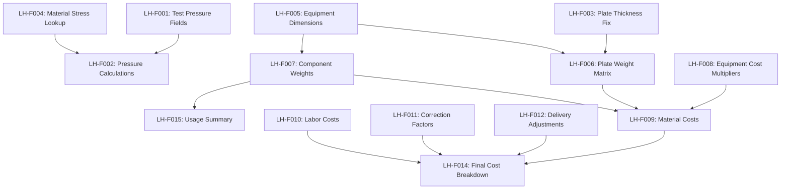

# EPIC-002: Excel Formula Implementation

## Epic Overview

- **Epic ID**: EPIC-002
- **Epic Title**: Implement 43 Excel Formula Patterns (962 Total Formulas)
- **Business Value**: Enable 100% accurate cost calculations matching Excel baseline
- **Total Story Points**: 63 SP
- **Priority**: CRITICAL (Production Blocking)
- **Duration**: 4 sprints (24 development hours)

## Background

Analysis revealed that 962 Excel formulas = 43 unique calculation patterns:

- 30 patterns × 13 equipment types = 390 repetitive calculations
- 10 aggregation patterns for cost summation
- 7 lookup patterns for material/dimension selection
- 5 conditional patterns for business logic
- 1 safety calculation pattern (CRITICAL)

Current implementation: ~20% (8-10 basic patterns completed)

## Success Criteria

- [ ] All 43 unique formula patterns implemented
- [ ] 100% calculation accuracy vs Excel baseline
- [ ] Safety pressure calculations operational (BLOCKING)
- [ ] All 13 equipment types working correctly
- [ ] Complete cost breakdown matching Excel output

## User Stories by Phase

### Phase 1: Safety-Critical (BLOCKING - 13 SP)

#### Story LH-F001: Add Test Pressure Fields

**As a** технолог  
**I want** hydraulic test pressure fields (N27/O27) in the technical input form  
**So that** I can specify required test pressures for safety compliance

**Acceptance Criteria:**

- [ ] Field `testPressureHot` (N27) added to TechnicalInputFormSimple.tsx
- [ ] Field `testPressureCold` (O27) added to TechnicalInputFormSimple.tsx
- [ ] Fields display with proper Russian labels ("Давление испытания Г/Х")
- [ ] Fields save to inputStore state correctly
- [ ] Fields persist in localStorage

**Technical Notes:**

- Update `/home/vmuser/dev/lh_calc/lh-calculator/src/components/TechnicalInputFormSimple.tsx`
- Update `/home/vmuser/dev/lh_calc/lh-calculator/src/types/index.ts` interface
- Add to localStorage persistence in inputStore

**Story Points:** 3  
**Priority:** CRITICAL

---

#### Story LH-F002: Implement Pressure Test Calculations

**As a** safety engineer  
**I want** automated hydraulic test pressure calculations (AI73/AJ73)  
**So that** test pressures meet safety standards per Excel formulas

**Acceptance Criteria:**

- [ ] Function `calculateTestPressure()` implemented
- [ ] Formula: `CEILING.PRECISE(1.25 * designPressure * 183 / allowableStress, 0.01)`
- [ ] Hot side calculation: uses J27, AG61 inputs
- [ ] Cold side calculation: uses K27, AK61 inputs
- [ ] Results populate N27/O27 fields automatically
- [ ] Test case: 22 bar → 31.46 bar (corrected value)

**Technical Notes:**

- Excel formulas: `=_xlfn.CEILING.PRECISE(1.25*AG73*$AA$60/AE73,0.01)`
- Material stress factor AA60 = 183 (09Г2С at 20°C)
- Use `Math.ceil(value / 0.01) * 0.01` for CEILING.PRECISE equivalent

**Story Points:** 5  
**Priority:** CRITICAL

---

#### Story LH-F003: Fix Plate Thickness Field Mapping

**As a** технолог  
**I want** correct plate thickness field (U27) mapping  
**So that** weight calculations use proper thickness values

**Acceptance Criteria:**

- [ ] Field `componentsA` renamed to `plateThickness`
- [ ] Label updated to "Толщина пластины" (Russian) / "Plate Thickness" (English)
- [ ] All calculation references updated to use new field name
- [ ] Validation: thickness > 0 and < 50mm

**Technical Notes:**

- Current mapping is incorrect: `componentsA: number; // U27`
- Should be: `plateThickness: number; // U27`
- Update all references in calculation engine

**Story Points:** 2  
**Priority:** HIGH

---

#### Story LH-F004: Material-Temperature Stress Lookup

**As a** design engineer  
**I want** temperature-based stress calculations (AG60/AK60)  
**So that** allowable stress values match material properties

**Acceptance Criteria:**

- [ ] VLOOKUP equivalent for temperature-stress table (Z60:AA68)
- [ ] Function returns allowable stress in MPa
- [ ] Supports interpolation for intermediate temperatures
- [ ] Material factor lookup (AA60 = 183 for 09Г2С)
- [ ] Used in pressure test calculations

**Technical Notes:**

- Excel: `=VLOOKUP(AF60,$Z$60:$AA$68,$AA$69)`
- Implement interpolation for smooth stress curves
- Create constants file for material properties

**Story Points:** 3  
**Priority:** CRITICAL

### Phase 2: Core Calculations (21 SP)

#### Story LH-F005: Equipment Dimension Matrix

**As a** cost estimator  
**I want** equipment-specific dimension lookups  
**So that** plate/cover sizes match equipment specifications

**Acceptance Criteria:**

- [ ] Equipment dimension table for all 13 types (К4-150 to К4-1200\*600)
- [ ] Plate dimensions (width/height) by equipment type
- [ ] Cover dimensions with manufacturing margins (+15mm pattern)
- [ ] Panel dimensions for each equipment type
- [ ] Column dimensions based on equipment size

**Technical Notes:**

- Extract dimension data from снабжение columns E110-F122
- Create EQUIPMENT_DIMENSIONS constant object
- Pattern: `(dimension + margin) * (dimension + margin)`

**Story Points:** 5  
**Priority:** HIGH

---

#### Story LH-F006: Plate Weight Calculation Matrix

**As a** cost calculator  
**I want** accurate plate weight calculations for all equipment types  
**So that** material costs reflect actual weights

**Acceptance Criteria:**

- [ ] Weight formula: `(width+15)*(height+15)*thickness*density/1000*plateCount`
- [ ] Applied to all 13 equipment types (H110-H122 pattern)
- [ ] Uses plateThickness (U27) and plateCount (I27)
- [ ] Material density from lookup table (G93)
- [ ] Results in kg with proper precision

**Technical Notes:**

- Excel pattern: `=(E110+15)*(F110+15)*G110*$G$93/1000*(технолог!$I$27)`
- Implement as single function with equipment type parameter
- Density = 7880 kg/m³ for standard steel

**Story Points:** 5  
**Priority:** HIGH

---

#### Story LH-F007: Component Weight Calculations

**As a** manufacturing planner  
**I want** weight calculations for all components (covers, columns, panels)  
**So that** total assembly weight is accurate

**Acceptance Criteria:**

- [ ] Cover weight calculations with equipment-specific dimensions
- [ ] Column weight calculations
- [ ] Panel weight calculations
- [ ] Gasket weight calculations
- [ ] Fastener weight calculations
- [ ] Total assembly weight summation (M21 pattern)

**Technical Notes:**

- Formula pattern: Volume × Density for each component
- Total weight: `(drawDepth + plateThickness) * 0.001 * plateCount + 2*coverWeight + 2*claddingThickness * 0.001`
- Implement component-by-component breakdown

**Story Points:** 8  
**Priority:** HIGH

---

#### Story LH-F008: Equipment Cost Multiplier Lookup

**As a** cost estimator  
**I want** equipment-specific cost multipliers (G20 pattern)  
**So that** base costs scale correctly by equipment size

**Acceptance Criteria:**

- [ ] Cost multiplier table for all 13 equipment types
- [ ] К4-150: 0.068, К4-200: 0.12, К4-300: 0.19, etc.
- [ ] Replaces complex IF chain in снабжение!G20
- [ ] Used in all cost calculations as base multiplier
- [ ] Validation: selected equipment type exists in table

**Technical Notes:**

- Replace Excel IF chain: `IF(технолог!G27="К4-150", 0.068, IF(...))`
- Create EQUIPMENT_COSTS constant object
- К4-750 = 1.0 (baseline), others scale proportionally

**Story Points:** 3  
**Priority:** HIGH

### Phase 3: Business Logic (21 SP)

#### Story LH-F009: Material Cost Calculations

**As a** procurement specialist  
**I want** detailed material cost breakdowns  
**So that** I can optimize material purchasing

**Acceptance Criteria:**

- [ ] Material cost = weight × price_per_kg for each component
- [ ] Separate costs for plates, covers, columns, panels
- [ ] Material price lookup from supply parameters
- [ ] Currency conversion if needed
- [ ] Cost breakdown by material type (steel grades)

**Technical Notes:**

- Formula pattern: `weight × material_price_per_kg`
- Integrate with material price tables
- Support multiple steel grades (AISI 316L, 09Г2С, etc.)

**Story Points:** 5  
**Priority:** MEDIUM

---

#### Story LH-F010: Labor Cost Allocation

**As a** production manager  
**I want** manufacturing labor cost calculations  
**So that** total costs include labor overhead

**Acceptance Criteria:**

- [ ] Labor hours calculation by component complexity
- [ ] Labor rate lookup by operation type
- [ ] Cutting labor costs
- [ ] Assembly labor costs
- [ ] Testing labor costs
- [ ] Total labor cost summation

**Technical Notes:**

- Labor cost = hours × hourly_rate
- Different rates for cutting, welding, assembly, testing
- Complexity factors by equipment size

**Story Points:** 5  
**Priority:** MEDIUM

---

#### Story LH-F011: Correction Factor Applications

**As a** manufacturing engineer  
**I want** manufacturing complexity corrections  
**So that** costs reflect actual production difficulty

**Acceptance Criteria:**

- [ ] Complexity correction factors by equipment type
- [ ] Material difficulty adjustments
- [ ] Size-based complexity scaling
- [ ] Applied to both material and labor costs
- [ ] Configurable correction percentages

**Technical Notes:**

- Formula pattern: `base_cost × correction_factor`
- Factors range from 0.8 to 1.5 based on complexity
- Applied after base cost calculations

**Story Points:** 3  
**Priority:** MEDIUM

---

#### Story LH-F012: Delivery Type Cost Adjustments

**As a** logistics coordinator  
**I want** delivery type cost calculations  
**So that** shipping costs are included in total price

**Acceptance Criteria:**

- [ ] Standard delivery cost calculation
- [ ] Express delivery premium (1.5x multiplier)
- [ ] International shipping adjustments
- [ ] Package size/weight based costs
- [ ] Delivery type selection in supply form

**Technical Notes:**

- Excel: `IF(технолог!G27="standard", 120000, IF(технолог!G27="express", 180000, 150000))`
- Replace with configurable delivery cost table
- Integrate with total cost summation

**Story Points:** 3  
**Priority:** MEDIUM

---

#### Story LH-F013: Material Compatibility Validation

**As a** design engineer  
**I want** material-pressure-temperature compatibility checks  
**So that** invalid configurations are prevented

**Acceptance Criteria:**

- [ ] Pressure rating validation by material
- [ ] Temperature limit checks
- [ ] Material-equipment type compatibility
- [ ] Warning messages for invalid combinations
- [ ] Automatic material suggestions for given conditions

**Technical Notes:**

- Implement validation rules matrix
- AISI 316L max pressure/temperature limits
- Steel grade compatibility with equipment types

**Story Points:** 5  
**Priority:** MEDIUM

### Phase 4: Aggregations (8 SP)

#### Story LH-F014: Final Cost Breakdown (результат Sheet)

**As a** project manager  
**I want** comprehensive cost breakdown matching Excel результат sheet  
**So that** I can present detailed cost analysis

**Acceptance Criteria:**

- [ ] Cost breakdown F26-X26: Plate costs, assembly costs, material costs, etc.
- [ ] Category totals J30-J36
- [ ] Total project cost calculation
- [ ] Cost per unit calculations
- [ ] Export to Excel format

**Technical Notes:**

- Mirror Excel результат sheet structure exactly
- Aggregate all previous calculations into final breakdown
- Support multiple currencies and units

**Story Points:** 5  
**Priority:** LOW

---

#### Story LH-F015: Component Usage Summary

**As a** inventory manager  
**I want** material usage summary by component  
**So that** I can plan material procurement

**Acceptance Criteria:**

- [ ] Total weight by material type
- [ ] Component count summaries
- [ ] Material utilization percentages
- [ ] Waste factor calculations
- [ ] Purchase recommendations with safety stock

**Technical Notes:**

- Aggregate all weight calculations
- Group by material type and component
- Add procurement planning features

**Story Points:** 3  
**Priority:** LOW

## Story Point Summary

| Phase                      | Stories | Story Points | Duration                 |
| -------------------------- | ------- | ------------ | ------------------------ |
| Phase 1: Safety-Critical   | 4       | 13 SP        | 1 sprint (4 hours)       |
| Phase 2: Core Calculations | 4       | 21 SP        | 1.5 sprints (8 hours)    |
| Phase 3: Business Logic    | 5       | 21 SP        | 1.5 sprints (8 hours)    |
| Phase 4: Aggregations      | 2       | 8 SP         | 1 sprint (4 hours)       |
| **TOTAL**                  | **15**  | **63 SP**    | **4 sprints (24 hours)** |

## Story Dependencies

## Definition of Done

For each story to be considered complete:

- [ ] **Code Implemented**: Feature working in application
- [ ] **Tests Written**: Unit tests covering core logic
- [ ] **Excel Validation**: Calculations match Excel output exactly
- [ ] **Integration Tests**: E2E tests updated and passing
- [ ] **Code Review**: Peer reviewed and approved
- [ ] **Documentation**: Technical documentation updated
- [ ] **User Acceptance**: Product owner approval

## Risk Mitigation

### High Risk Items

- **Safety calculations accuracy**: Extra validation required for pressure calculations
- **Excel formula complexity**: Some formulas may need simplification
- **Performance**: 962 formulas may impact calculation speed

### Mitigation Strategies

- **Validation**: Every formula validated against Excel test cases
- **Performance**: Optimize repeated calculations with caching
- **Safety**: Double-check all pressure-related calculations

## Technical Implementation Notes

### Formula Accuracy Requirements

- All calculations must match Excel output to 0.01 precision
- CEILING.PRECISE function: Use `Math.ceil(value / precision) * precision`
- VLOOKUP with interpolation for smooth curves
- IF chains replaced with lookup tables for maintainability

### Code Organization

- `/src/lib/calculation-engine/formula-library-complete.ts` - All formula implementations
- `/src/lib/calculation-engine/constants.ts` - Equipment tables, material properties
- `/src/lib/calculation-engine/types.ts` - TypeScript interfaces
- `/src/components/TechnicalInputFormSimple.tsx` - Form updates

### Testing Strategy

- Unit tests for each formula pattern
- Integration tests for complete calculation flows
- Excel comparison tests with known test cases
- Performance tests for 13 equipment types × 30+ calculations

---

**Epic Status**: READY FOR SPRINT PLANNING  
**Next Action**: Begin Phase 1 with LH-F001 (Add Test Pressure Fields)  
**Estimated Completion**: 4 sprints from start date
