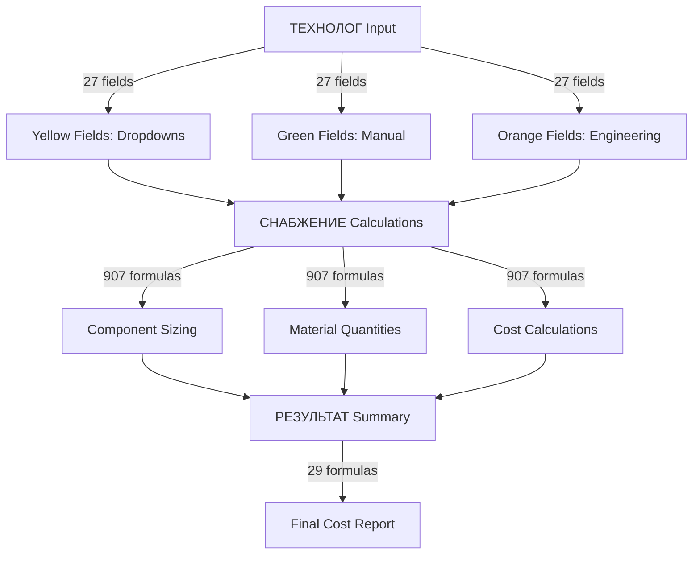

# Complete Excel Cell Mapping - Heat Exchanger Cost Calculator

## 📊 Color Legend & User Roles

| Color           | Hex Code  | RGB        | Meaning                 | Who Enters       | Input Method              |
| --------------- | --------- | ---------- | ----------------------- | ---------------- | ------------------------- |
| 🟨 **Yellow**   | `#FFFF00` | 255,255,0  | Configuration Selection | Technologist     | Dropdown from named range |
| 🟩 **Green**    | `#92D050` | 146,208,80 | Technical Parameters    | Technologist     | Manual entry              |
| 🟧 **Orange**   | `#FFC000` | 255,192,0  | Engineering Input       | Design Engineer  | Manual/Dropdown           |
| 🔴 **Red**      | `#FF0000` | 255,0,0    | Management Override     | General Director | Manual (protected)        |
| ⬜ **No Color** | Default   | -          | Calculated/Display      | System           | Formula/Locked            |

---

## 📋 SHEET 1: ТЕХНОЛОГ (TECHNOLOGIST)

_Dimensions: 75 rows × 38 columns_
_Purpose: Technical specification input for heat exchanger design_

### 🔤 Header Section (Rows 1-10)

| Cell | Color      | Content                             | Type  | Purpose                               |
| ---- | ---------- | ----------------------------------- | ----- | ------------------------------------- |
| E4   | 🟨 Yellow  | "Ползуйтесь для выбора"             | Label | Instructions: "Use for selection"     |
| E5   | 🟩 Green   | "обязательно к заполнению"          | Label | Instructions: "Required field"        |
| E6   | 🟧 Orange  | "заполняет инженер или конструктор" | Label | Instructions: "Engineer fills"        |
| E7   | ⬜ Default | "выставится автоматически"          | Label | Instructions: "Automatic calculation" |
| E8   | ⬜ Default | "в результат НЕЛЬЗЯ ПРАВИТЬ"        | Label | Instructions: "DO NOT EDIT result"    |

### 📝 Main Input Section (Row 27 - Primary Data Entry)

#### Technical Identification

| Cell | Color     | Field Name         | Value/Formula | Purpose                      |
| ---- | --------- | ------------------ | ------------- | ---------------------------- |
| D27  | 🟩 Green  | номер у технолога  | 1             | Internal technologist number |
| E27  | 🟩 Green  | Номер позиции в ОЛ | "Е-113"       | Customer order position      |
| F27  | 🟨 Yellow | тип поставки       | "Целый ТА"    | Delivery type (dropdown)     |

#### Equipment Configuration

| Cell | Color     | Field Name         | Value/Formula | Purpose                 |
| ---- | --------- | ------------------ | ------------- | ----------------------- |
| G27  | 🟨 Yellow | типоразмер К4      | "К4-750"      | Equipment type/size     |
| H27  | 🟩 Green  | ходы               | "1/6"         | Flow pass configuration |
| I27  | 🟩 Green  | Количество пластин | 400           | Number of plates        |

#### Operating Parameters

| Cell | Color    | Field Name               | Value/Formula | Purpose                    |
| ---- | -------- | ------------------------ | ------------- | -------------------------- |
| J27  | 🟩 Green | Расч Давл по Гор Ст      | 22            | Hot side pressure (bar)    |
| K27  | 🟩 Green | Расч Давл по хол ст      | 22            | Cold side pressure (bar)   |
| L27  | 🟩 Green | Расч Темп по Гор Стороне | 100           | Hot side temperature (°C)  |
| M27  | 🟩 Green | Расч Темп по Хол Стороне | 100           | Cold side temperature (°C) |

#### Calculated Fields

| Cell | Color      | Field Name           | Value/Formula | Purpose                         |
| ---- | ---------- | -------------------- | ------------- | ------------------------------- |
| N27  | ⬜ Default | давление испытания Г | =AJ73         | Test pressure hot (calculated)  |
| O27  | ⬜ Default | давление испытания Х | =AI73         | Test pressure cold (calculated) |

#### Material Selection

| Cell | Color     | Field Name                   | Value/Formula | Purpose                  |
| ---- | --------- | ---------------------------- | ------------- | ------------------------ |
| P27  | 🟨 Yellow | материал пластин             | "AISI 316L"   | Plate material           |
| Q27  | 🟨 Yellow | материал пластин дубль       | =P27          | Duplicate plate material |
| R27  | 🟨 Yellow | материал корпуса             | "09Г2С"       | Housing material         |
| S27  | 🟨 Yellow | тип поверхности              | "гофра"       | Surface type             |
| T27  | 🟩 Green  | толщина пластины дубль       | 5             | Plate thickness (alt)    |
| U27  | 🟨 Yellow | толщина пластины             | 1             | Plate thickness (mm)     |
| V27  | 🟧 Orange | количество крепежных панелей | 3             | Mounting panels count    |

### 📊 Lookup Tables (Rows 60-75)

#### Material Density Table (Z60:AA68)

| Row | Pressure | Size Factor |
| --- | -------- | ----------- |
| 60  | 50       | 170         |
| 61  | 100      | 160         |
| 62  | 150      | 154         |
| 63  | 200      | 150         |
| 64  | 250      | 147         |
| 65  | 300      | 144         |
| 66  | 350      | 142         |
| 67  | 400      | 140         |

#### Test Pressure Calculations (AI73, AJ73)

| Cell | Formula                     | Purpose                                 |
| ---- | --------------------------- | --------------------------------------- |
| AI73 | `=ПОТОЛОК.ТОЧН(K27*1.25;1)` | Cold test pressure (1.25 safety factor) |
| AJ73 | `=ПОТОЛОК.ТОЧН(J27*1.25;1)` | Hot test pressure (1.25 safety factor)  |

---

## 📋 SHEET 2: СНАБЖЕНИЕ (SUPPLY)

_Dimensions: 162 rows × 61 columns_
_Purpose: Component calculations, material quantities, and cost analysis_

### 🏢 Project Information (Rows 1-10)

| Cell | Color      | Field                                | Value/Formula | Purpose                 |
| ---- | ---------- | ------------------------------------ | ------------- | ----------------------- |
| F2   | 🟩 Green   | номер проекта                        | "0000"        | Project number          |
| N2   | 🟨 Yellow  | "лист снабжения"                     | Label         | Sheet title             |
| N3   | 🟩 Green   | "ячейки зеленые заполняет снабжение" | Label         | Green = supply fills    |
| N4   | 🟧 Orange  | "оранжевые конструктор или инженер"  | Label         | Orange = engineer fills |
| N5   | ⬜ Default | "белые не меняем"                    | Label         | White = don't change    |
| N6   | ⬜ Default | "КРАСНЫЕ ГЕНЕРАЛЬНЫЙ ДИРЕКТОР"       | Label         | Red = General Director  |

### 🔧 Connection Specifications (Rows 7-9)

| Cell | Color      | Field                   | Value/Formula | Purpose                  |
| ---- | ---------- | ----------------------- | ------------- | ------------------------ |
| D7   | ⬜ Default | "ПРОЧЕЕ"                | Label         | Other specifications     |
| D8   | 🟩 Green   | диаметр подключения гор | 700           | Hot connection diameter  |
| E8   | 🟩 Green   | диаметр подключения хол | 700           | Cold connection diameter |
| D9   | 🟧 Orange  | материал подключений    | "09Г2С"       | Connection material      |

### 💰 Pricing & Quantity (Row 13)

| Cell | Color    | Field                | Value/Formula | Purpose            |
| ---- | -------- | -------------------- | ------------- | ------------------ |
| K13  | 🟩 Green | количество аппаратов | 1             | Number of units    |
| P13  | 🟩 Green | цена за кг стали     | 120000        | Steel price per kg |

### 🔩 Component Calculations (Rows 18-40)

#### Dimensions & Quantities

| Cell | Formula                                                                      | Purpose                  |
| ---- | ---------------------------------------------------------------------------- | ------------------------ |
| E19  | `=F19+T19`                                                                   | Total width calculation  |
| G19  | `=M21-E19`                                                                   | Clearance calculation    |
| K19  | `=(E19+F19)*0.12`                                                            | Material factor          |
| M21  | `=(технолог!T27+технолог!U27)*0.001*технолог!I27+2*E19+2*технолог!V27*0.001` | Total assembly thickness |

#### Conditional Calculations

| Cell | Formula Type       | Purpose                    |
| ---- | ------------------ | -------------------------- |
| G22  | IF statement       | Size-dependent calculation |
| G20  | Complex arithmetic | Component dimensions       |
| H29  | SUM                | Total component cost       |

### 🏭 Equipment Specifications Table (Rows 110-122)

This is the master lookup table for 13 equipment types (К4-150 through К4-1200\*600):

| Row | Type         | Width | Height | Plates | Weight Factor | Cost Factor      |
| --- | ------------ | ----- | ------ | ------ | ------------- | ---------------- |
| 110 | К4-150       | 143   | 128    | 150    | 0.068         | Base calculation |
| 111 | К4-200       | 227   | 212    | 200    | 0.12          | Base × 1.76      |
| 112 | К4-300       | 302   | 287    | 300    | 0.19          | Base × 2.79      |
| 113 | К4-400       | 373   | 360    | 400    | 0.28          | Base × 4.12      |
| 114 | К4-500       | 476   | 455    | 500    | 0.40          | Base × 5.88      |
| 115 | К4-500\*250  | 476   | 255    | 500    | 0.27          | Base × 3.97      |
| 116 | К4-600       | 502   | 487    | 600    | 0.60          | Base × 8.82      |
| 117 | К4-600\*300  | 502   | 287    | 600    | 0.37          | Base × 5.44      |
| 118 | К4-750       | 600   | 580    | 750    | 1.00          | Base × 14.71     |
| 119 | К4-1000\*500 | 800   | 500    | 1000   | 1.01          | Base × 14.85     |
| 120 | К4-1000      | 800   | 780    | 1000   | 1.63          | Base × 23.97     |
| 121 | К4-1200      | 950   | 920    | 1200   | 2.43          | Base × 35.74     |
| 122 | К4-1200\*600 | 950   | 600    | 1200   | 1.53          | Base × 22.50     |

### 📐 Material Calculations (Each row calculates for one equipment type)

#### Weight Calculations (Column M)

| Row  | Formula                                                 | Equipment |
| ---- | ------------------------------------------------------- | --------- |
| M110 | `=(E110+15)*(F110+15)*G110*$G$93/1000*(технолог!$I$27)` | К4-150    |
| M111 | `=(E111+15)*(F111+15)*G111*$G$93/1000*(технолог!$I$27)` | К4-200    |
| ...  | Same pattern for all 13 types                           | ...       |

#### Volume Calculations (Column N)

| Row       | Formula                                | Purpose                  |
| --------- | -------------------------------------- | ------------------------ |
| N110-N122 | `=M[row]*N[row]*density*factor/1000*4` | Material volume per type |

### 🔴 Management Override Fields (Rows 93, 96)

| Cell | Color  | Field                  | Purpose                      |
| ---- | ------ | ---------------------- | ---------------------------- |
| G93  | 🔴 Red | коэффициент управления | Management adjustment factor |
| G96  | 🔴 Red | резерв директора       | Director's reserve amount    |

### 📋 Named Ranges (Configuration Lists)

| Range            | Location  | Content                                          | Used For          |
| ---------------- | --------- | ------------------------------------------------ | ----------------- |
| материал_корпуса | AU47:AU54 | AISI 316L, AISI 304, Ст3, Ст20, 09Г2С, 12Х18Н10Т | Housing materials |
| материал_пластин | AS47:AS54 | AISI 316L, AISI 304, 0.4, 0.5, 0.6, 0.7          | Plate materials   |
| тип_поверхности  | AZ36:AZ40 | гофра, гладкая, турбулизатор, шеврон, микс       | Surface types     |
| типоразмеры_К4   | AM45:AM52 | К4-150 through К4-1200\*600                      | Equipment sizes   |

---

## 📋 SHEET 3: РЕЗУЛЬТАТ (RESULT)

_Dimensions: 38 rows × 24 columns_
_Purpose: Final cost summary and results aggregation_

### 💵 Cost Summary Section (Rows 23-36)

| Cell | Formula                           | Purpose                | Category   |
| ---- | --------------------------------- | ---------------------- | ---------- |
| F23  | `=снабжение!K14`                  | Unit quantity          | Basic Info |
| G23  | `=снабжение!G35+снабжение!M35`    | Total component cost   | Components |
| K23  | Complex calculation               | Equipment base cost    | Main Cost  |
| N23  | `=снабжение!F78*снабжение!D8+...` | Total with connections | Total      |
| O23  | `=снабжение!P78`                  | Labor costs            | Labor      |

### 📊 Material Requirements (Row 26)

| Cell | Formula                        | Purpose                      |
| ---- | ------------------------------ | ---------------------------- |
| E26  | Complex IF/AND validation      | Material compatibility check |
| F26  | `=снабжение!K14`               | Confirmed quantity           |
| G26  | `=снабжение!G35+снабжение!M35` | Component subtotal           |
| H26  | Main calculation formula       | Primary equipment cost       |

### 🔄 Cross-Sheet Dependencies

#### From технолог Sheet (10 references)

- Equipment type (G27)
- Plate count (I27)
- Materials (P27, R27)
- Operating parameters (J27, K27, L27, M27)

#### From снабжение Sheet (51 references)

- All cost calculations
- Component quantities
- Material requirements
- Labor and overhead

### 📈 Final Calculations

| Category              | Cells   | Purpose                      |
| --------------------- | ------- | ---------------------------- |
| J31_CorpusCategory    | Various | Housing/frame costs          |
| J32_CoreCategory      | Various | Plate assembly costs         |
| J33_SupportsCategory  | Various | Support structure costs      |
| J34_OtherCategory     | Various | Miscellaneous components     |
| J35_COFCategory       | Various | Connections/flanges/fittings |
| J36_InternalLogistics | Various | Internal transport/handling  |

---

## 🔄 Data Flow Summary

## 📝 Key Insights

1. **Color-Coded Access Control**: Different colors enforce role-based data entry
2. **Cascading Calculations**: 962 formulas create complex interdependencies
3. **Equipment Type Matrix**: 13 equipment types with unique specifications
4. **Safety Factors**: 1.25× safety factor on pressure calculations
5. **Material Compatibility**: Validation ensures proper material combinations
6. **Multi-Level Pricing**: Base prices modified by size, material, and quantity factors

## 🎯 Critical Input Fields (Must Be Filled)

### Priority 1 (Technologist - Green & Yellow)

- G27: Equipment type (К4-750)
- I27: Plate count (400)
- P27: Plate material (AISI 316L)
- R27: Housing material (09Г2С)
- J27, K27: Operating pressures
- L27, M27: Operating temperatures

### Priority 2 (Supply - Green)

- F2: Project number
- D8, E8: Connection diameters
- K13: Unit quantity
- P13: Steel price

### Priority 3 (Engineering - Orange)

- V27: Panel count
- D9: Connection material
- Various flange specifications

This comprehensive mapping provides complete visibility into every meaningful cell, its purpose, color coding, and role in the calculation system.
